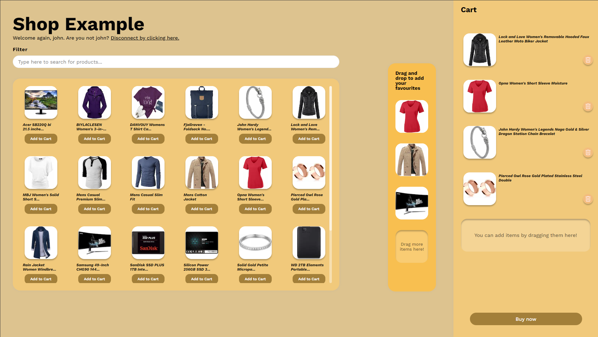

# Shop example with Next.js

This is a simple shop example made with Next.js + Typescript. The app is a simple shop example with a list of products, favorites and a cart, with Login authentication.



## 🚀 How to run

1. Clone the repository
2. Run `npm install` to install the dependencies
3. Run `npm run dev` to start the development server
4. Open [http://localhost:3000/login](http://localhost:3000/login) with your browser to see the result.\*

> [!NOTE]
> \*You can also access the dashboard directly by going to [http://localhost:3000/dashboard](http://localhost:3000/dashboard) or [http://localhost:3000](http://localhost:3000) if you are already logged in. If not, you will be redirected to the login screen.

---

## 🌱 Dependencies used

- Next.js
- React
- Typescript
- Axios
- Redux
- Redux-persist
- Dnd-kit
- Styled-components
- Eslint
- Jest

---

## 🧪 Tests Coverage

The unit and integration tests were made using Jest and React Testing Library. You can run the tests with the following command:

```bash
npm run test
```

Here is summarized the coverage report of the tests suites:

| % Stmts | % Branch | % Funcs | % Lines |
| ------- | -------- | ------- | ------- |
| 93.38   | 94.94    | 70.73   | 93.38   |

- Test Suites: 14 passed, 14 total
- Tests: 57 passed, 57 total
- Snapshots: 0 total
- Time: 8.813 s

The coverage report is available in the `coverage` folder.

I personally decided to not test the components that are already tested by the library itself (like the dnd-kit components) and the components that are too simple to test (like the styled components). I also decided to not test the API calls because they are mocked and tested in the integration tests.

I also didn't test all the functionalities of the Dashboard component because it is a big component and it would take some time to test all the functionalities, but since the overall coverage is farly above the 50% mark, I decided to not test all the functionalities.

---

## ✒ Linting

The code was linted using Eslint with the following command:

```bash
npm run lint
```

The linting rules are faily simple and they are based on the Airbnb style guide with some modifications to fit the project requirements and are available in the `.eslintrc.js` file.

---

## 🚶‍♂️ Walkthrough

- The app is a simple shop example with a list of products and a cart.
- You need to be logged in to see the products and add them to the cart. Here you can use the following credentials for testing puroses:

  | Email              | Password  | Name           |
  | ------------------ | --------- | -------------- |
  | john@gmail.com     | m38rmF$   | John Doe       |
  | morrison@gmail.com | 83r5^\_   | David Morrison |
  | kevin@gmail.com    | kev02937@ | Kevin Ryan     |
  | don@gmail.com      | ewedon    | Don Romer      |

- Once logged in, you can see the list of products and add them to the cart.
- You can filter the products by name. The filter is case insensitive and it will match any part of the name.
- The products are ordered by name alphabetically.
- You can drag and drop the products in the cart or in the favorites section.
- You can also remove the products from the cart or the favorites section by dragging outside.
- You can remove products from cart by clicking the trash icon.
- The cart and favorites are persisted using redux between users.
- You can logout by clicking the **"Disconnect by click here."** link in the header.
- The **"Buy Now"** button is disabled if the cart is empty. If you click it, it wouldn't do anything.
- The app redirects to the dashboard or login screen depending on the user's authentication status if you enter the app directly by the URL, or fail the URL navigation.
- The app is kind of responsive and it will adapt to the next screen sizes:

  - 1920x1080px
  - 1366x768px
  - 1280x720px
  - 1280x832px (Figma design)

---

## 📑 Design & development decisions taken

### 🛠 Development tools

- I decided to use Next.js because it is a framework that I am familiar with and it is easy to set up with typescript and jest.
- I decided to use Redux because it is a state management library that I am familiar with and it is easy to set up with redux-persist.
- I decided to use Axios because it is a promise-based HTTP client that I am familiar with and it is easy to set up with typescript.
- I decided to use Dnd-kit because it is a modern, lightweight, performant drag and drop library that I wasn't familiar with but I wanted to learn.
- I decided to use the `https://fakestoreapi.com/` API to get the products because it is a public API that fulfills the requirements.
- I decided to use Jest because it is a testing library that I am familiar with and it is easy to set up with react-testing-library.

### 🖼 Design and changes made on Figma design

- I decided to use the Figma design as a reference for the layout, colors, icons, and typography.
- I decided to adapt the design to the screen sizes mentioned above.
- I decided to add a subtitle header with a logout link to disconnect the user for better testing purposes and UX.
- I decided to modify the minimum amount of products visible on the shop depending on the screen size to make use off empty screen space in bigger resolutions.
- I decided to make the products list, favorites list and cart scrollable so it doesn't overflow the screen. The scrollbars are hidden by default and the design wasn't part of the figma design.
- I decided to add a disabled style on buttons when they are not clickable to give feedback to the user.
- I decided to add a loading message when the products are being fetched to give feedback to the user.
- I decided to add a border to the favorites list when dragging an item to make it more visible and separate from the cart.
- I decided to move the trash icon to the bottom-right of the product in the cart to don't interfere with the title lenghts.
- I decided to add a placeholder text in the filter input to give feedback to the user.
- I decided to add a "no results" message when the filter doesn't match any product to give feedback to the user.
- I created the modal component to show the confirmation message when the user removes a product from the favorites list.
- I decided to add an alert banner to show user feedback during the actions (add items, remove items, credentials failure, etc).
- I decided to not remove products from the product list when they are added to the favorites list to not confuse the user and to keep the list consistent in case they are in mobile devices.
- I changed the login screen icon to make it fit better with the design.
- I decided to change the shop title from "Pet app" to "Shop Example" to make it more generic.
- I decided to add placeholder messages in the favorites lists and cart empty product slots to give feedback to the user that they can drop items there.
- Some small changes in margins and positions were made to the design to make it more responsive and to make it fit better with the requirements.
